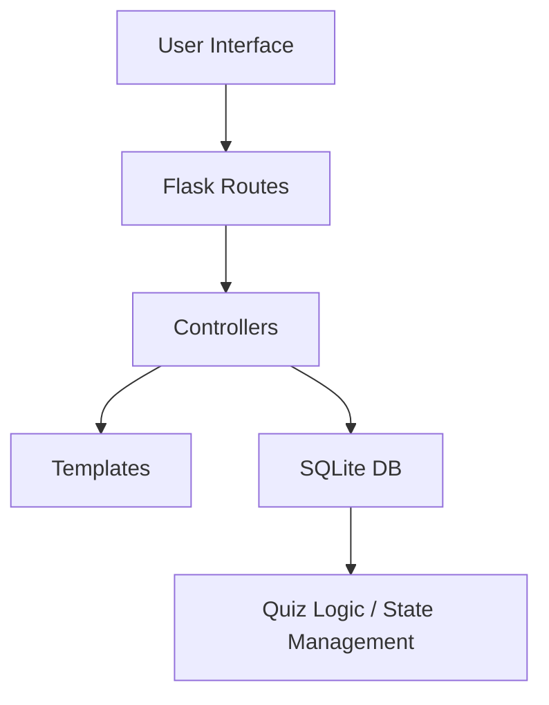

# 📘 PrepMe – Interactive Learning Platform

Welcome to **PrepMe**, a full-stack Flask web application designed for dynamic flashcard-based quizzes, real-time feedback, admin question editing, and course modularity. This README provides everything you need to run, develop, and contribute to the app.

---

## 🧭 Table of Contents

* [Features](#-features)
* [Demo](#-demo)
* [Tech Stack](#-tech-stack)
* [Architecture](#-architecture)
* [Getting Started](#-getting-started)
* [Usage Guide](#-usage-guide)
* [Admin Tools](#-admin-tools)
* [Contributing](#-contributing)
* [License](#-license)

---

## ✨ Features

* 🔒 User authentication (login/logout)
* 📚 Modular course + module system
* ✅ Real-time quiz with score tracking
* ❌ Missed question review
* 🔄 Admin interface to edit questions and enable/disable modules
* 🌓 Full dark mode support
* 🔍 Searchable help page with toggleable themes

---

## 📸 Demo


---

## ⚙️ Tech Stack

| Layer    | Technology             |
| -------- | ---------------------- |
| Frontend | HTML, Tailwind CSS, JS |
| Backend  | Flask, Jinja2          |
| Database | SQLite                 |
| Security | Flask-Session, Fernet  |
| Auth     | Username-based login   |

---

## 🧱 Architecture



---

## 🚀 Getting Started

### 1. Clone the repo

```bash
git clone https://github.com/youruser/flashcard-pro.git
cd flashcard-pro
```

### 2. Create virtual environment

```bash
python3 -m venv venv
source venv/bin/activate  # On Windows: venv\Scripts\activate
```

### 3. Install dependencies

```bash
pip install -r requirements.txt
```

### 4. Run the app

```bash
flask run
```

---

## 📘 Usage Guide

### 🔐 Login

Users must log in with their username (no password required).

### 🧪 Quiz Mode

* Choose a course and module
* Select random or sequential order
* Submit answers, skip questions, or end early

### 📊 Scoreboard

View a history of all quiz attempts including:

* Module title
* Timestamp
* Correct/total answers
* Links to missed question reviews

### ❌ Missed Questions

View only the questions you missed and compare your answer vs. correct.

---

## 🛠️ Admin Tools

* **Edit Modules:** Toggle on/off, rename
* **Edit Questions:** Inline editing of question, options, and correct answer
* **Add/Remove Questions:** (Planned feature)

---

## 🆘 Help System

A searchable, dark-mode compatible help page is available via the Help tab in the navbar.

---

## 🙌 Contributing

We welcome pull requests!

1. Fork this repository
2. Create a feature branch
3. Push and submit a PR

Please follow conventional commit messages and comment your code clearly.

---

## 🪪 License

MIT License © 2025 PrepMe Team
