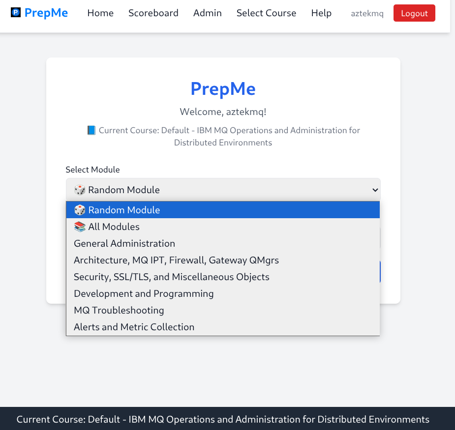

# 📘 PrepMe – Interactive Learning Platform

### Technical Description of PrepMe

**PrepMe: A Modular, Extensible Full-Stack Flask Application for Adaptive Learning**

PrepMe is a full-stack web application implemented in Python using the Flask microframework, designed to deliver dynamic, flashcard-based quizzes with real-time feedback, administrative question management, and a modular course structure. The application leverages a Model-View-Controller (MVC) architectural pattern to ensure separation of concerns, scalability, and maintainability. Its backend is powered by Flask, with SQLAlchemy for ORM-based database interactions, supporting PostgreSQL or SQLite for flexible deployment. The frontend employs Jinja2 templating, Bootstrap for responsive design, and JavaScript for dynamic client-side interactions, such as real-time quiz feedback. Authentication is handled via Flask-Login, with role-based access control (RBAC) for users and administrators.

**Modular Design**: PrepMe’s architecture is inherently modular, with distinct components for quiz management, course structuring, user authentication, and feedback analytics. The application organizes functionality into Flask Blueprints, enabling independent development and testing of modules (e.g., quiz engine, admin panel, user dashboard). Each module is loosely coupled, communicating through well-defined interfaces, such as RESTful API endpoints or database models, facilitating feature additions without disrupting existing functionality. 

**Extensibility**: PrepMe is designed for high extensibility, supporting the addition of new features through a plugin-based system. Developers can extend the application by defining new question types, feedback algorithms, or integration with external systems (e.g., IBM MQ for asynchronous quiz processing or App Connect Enterprise for workflow automation). The database schema is normalized yet flexible, using polymorphic associations to support diverse question formats. The use of dependency injection and configuration files (e.g., YAML or environment variables) allows runtime customization of database backends, authentication providers, or third-party APIs. This extensibility makes PrepMe adaptable to various educational contexts, from simple flashcard apps to complex learning management systems.

**Scalability and Performance**: PrepMe employs asynchronous task queues (e.g., Celery with Redis) for handling computationally intensive tasks, such as real-time feedback generation or bulk question imports. Caching with Flask-Caching reduces database queries for frequently accessed quiz data. The application supports horizontal scaling through containerization (e.g., Docker) and deployment on cloud platforms like AWS or Kubernetes, ensuring performance under high user loads.

**Security and Reliability**: Security features include password hashing with bcrypt, CSRF protection, and secure session management. Error handling is robust, with custom exception classes and logging to track issues. Unit and integration tests, implemented with pytest, ensure reliability across modules.

**Modular Use Cases**: The modularity enables PrepMe to be extended for gamified learning (e.g., adding leaderboards), AI-driven question generation (e.g., integrating with NLP models), or distributed systems integration (e.g., IBM MQ for message-driven quiz delivery). The admin panel supports dynamic question editing, with RESTful endpoints for programmatic content management, making it suitable for both manual and automated workflows.


---

## 🧭 Table of Contents


* [Features](#-features)
* [Screens](#-screens)
* [Courses](#-courses)
* [Tech Stack](#-tech-stack)
* [Architecture](#-architecture)
* [Getting Started](#-getting-started)
* [Usage Guide](#-usage-guide)
* [Admin Tools](#-admin-tools)
* [Contributing](#-contributing)
* [License](#-license)

---

## ✨ Features

* 🔒 User authentication (login/logout)
* 📚 Modular course + module system
* ✅ Real-time quiz with score tracking
* ❌ Missed question review
* 🔄 Admin interface to edit questions and enable/disable modules
* 🔍 Searchable help page with toggleable themes

---

## 📸 Screens





---

## Courses

## IBM MQ
- **IBM MQ Operations and Administration for iSeries**: Focuses on setup, configuration, and management of IBM MQ on iSeries (AS/400) systems.
- **IBM MQ Operations and Administration for Distributed Environments**: Covers administration and operations of IBM MQ in distributed systems (e.g., Linux, Windows).
- **IBM MQ Operations and Administration for z/OS**: Addresses IBM MQ administration specific to z/OS mainframe environments.
- **IBM MQ Architectures**: Explores IBM MQ architecture, high availability, security, and integration in enterprise settings.
- **Advanced IBM MQ Troubleshooting**: Provides advanced techniques for diagnosing and resolving IBM MQ issues, including performance and security.

## AWS
- **Advanced Terraform for AWS Infrastructure in Enterprise Environments**: Teaches Terraform for managing AWS infrastructure, covering networking, compute, and CI/CD.
- **Advanced Python Lambda Functions for AWS**: Focuses on developing and optimizing AWS Lambda functions using Python for serverless applications.

## IBM App Connect Enterprise
- **IBM App Connect Enterprise**: Covers message flows, connectors, administration, and advanced features for IBM App Connect Enterprise integration.

## Python
- **Advanced Python**: Explores advanced Python programming, including data structures, concurrency, metaprogramming, and integration with IBM MQ/ACE.

## Security
- **CompTIA Security+**: Provides comprehensive training on threats, network security, IAM, cryptography, and compliance for IT security professionals.

## Artificial Intelligence
- **Advanced Artificial Intelligence**: Covers advanced AI topics like neural networks, reinforcement learning, generative models, and AI ethics.

## IT Communication
- **Advanced English Comprehension for IT Corporate Environments**: Focuses on technical writing, presentations, and professional communication in IT settings.


---

## ⚙️ Tech Stack

| Layer    | Technology             |
| -------- | ---------------------- |
| Frontend | HTML, Tailwind CSS, JS |
| Backend  | Flask, Jinja2          |
| Database | SQLite                 |
| Security | Flask-Session, Fernet  |
| Auth     | Username-based login   |

---

## 🧱 Architecture


---

## 🚀 Getting Started

### 1. Clone the repo

```bash
git clone https://github.com/youruser/flashcard-pro.git
cd flashcard-pro
```

### 2. Create virtual environment

```bash
python3 -m venv venv
source venv/bin/activate  # On Windows: venv\Scripts\activate
```

### 3. Install dependencies

```bash
pip install -r requirements.txt
```

### 4. Run the app

```bash
flask run
```

---

## 📘 Usage Guide

### 🔐 Login

Users must log in with their username (no password required).

### 🧪 Quiz Mode

* Choose a course and module
* Select random or sequential order
* Submit answers, skip questions, or end early

### 📊 Scoreboard

View a history of all quiz attempts including:

* Module title
* Timestamp
* Correct/total answers
* Links to missed question reviews

### ❌ Missed Questions

View only the questions you missed and compare your answer vs. correct.

---

## 🛠️ Admin Tools

* **Edit Modules:** Toggle on/off, rename
* **Edit Questions:** Inline editing of question, options, and correct answer
* **Add/Remove Questions:** (Planned feature)

---

## 🆘 Help System

A searchable, dark-mode compatible help page is available via the Help tab in the navbar.

---

## 🙌 Contributing

We welcome pull requests!

1. Fork this repository
2. Create a feature branch
3. Push and submit a PR

Please follow conventional commit messages and comment your code clearly.

---

## 🪪 License

MIT License © 2025 PrepMe Team
